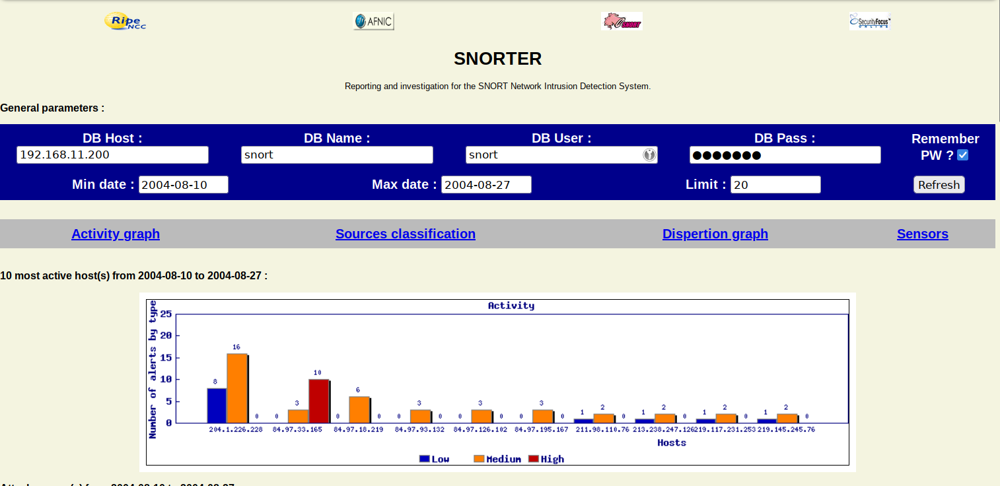
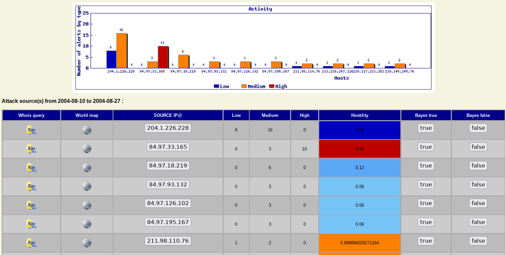
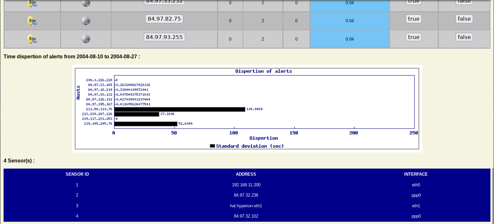
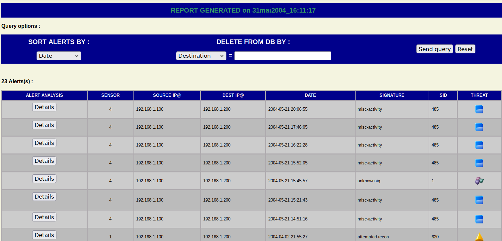
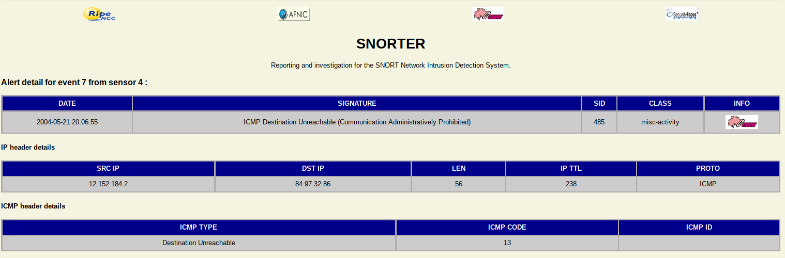

# Snorter
HTML reporting tool for the network intrusion detection system SNORT

DESCRIPTION

SNORTER connects to the MYSQL SGBD and query it for events generated by SNORT or any other device using SNORT-DB format. 

Features :

The features of Snorter are :

- Hostility based report (from attack classes and bayesian statistics)
- Investigating on events with whois queries, snortDB queries, world map tracing...
- Managing the database : deletion of events with the choice of the delete critera (IPSRC, IPDST, SIGNATURE, DATE)
- Event packet decode
- Bayesian learning about false positives, Activity graph, Time-Dispersion graph
- Embedded web server

Screenshots :

  

